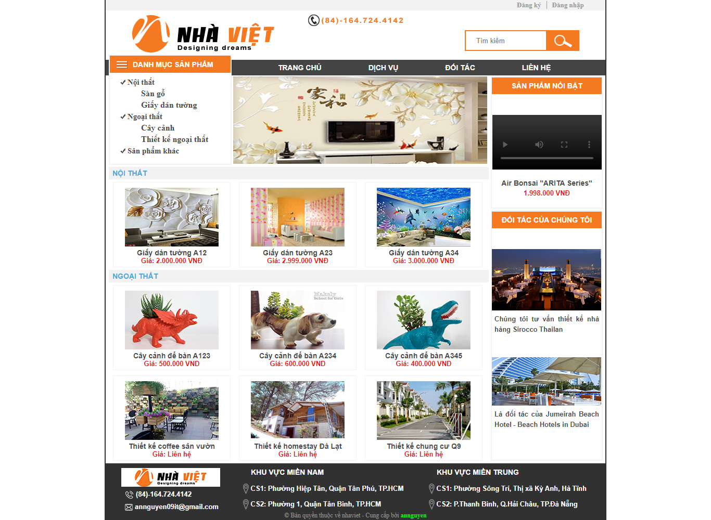

# 
NhaViet

	(My first frontend website project)

# Giới thiệu
Website tĩnh "NhaViet" xây dựng với mục đích phục vụ hoạt động mua bán, kinh doanh các sản phẩm nội thất, trang trí nhà ở

# Công nghệ sử dụng
- Frontend: html5, css3, javascript

# Công cụ xây dựng chương trình
- IDE: Sublime Text

# Giao diện
## a. Giao diện người dùng ##

#### 1. Trang chủ

	

...........................
## b. Giao diện quản trị ##

............................